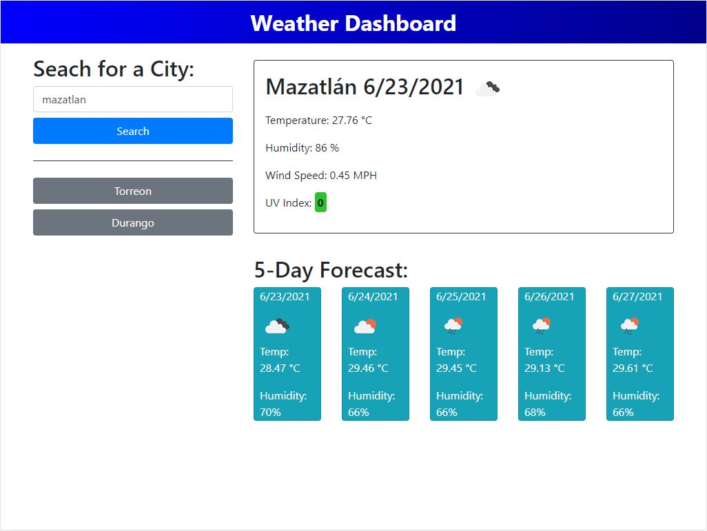

<!-- PROJECT TITE -->
  <h1 align="center">Server-Side-APIs: Weather Dashboard</h1>

<!-- DESCRIPTION -->
  

    A weather dashboard that will run in the browser and feature dynamically updated HTML and CSS.
    Uses the OpenWeather One Call API to retrieve weather data for cities.

  <!-- DEPLOYED LINK -->
  Live Page: https://saidhadad.github.io/Server-Side-APIs/
   
  GitHub repository URL: https://github.com/SaidHadad/Server-Side-APIs

<!-- TABLE OF CONTENTS -->

  
Table of Contents

  <ol>
    <li><a href="#about-the-project">About The Project</a></li>
    <li><a href="#built-with">Built With</a></li>
    <li>
      <a href="#getting-started">Getting Started</a>
      <ul>
        <li><a href="#prerequisites">Prerequisites</a></li>
        <li><a href="#installation">Installation</a></li>
      </ul>
    </li>
    <li><a href="#contributing">Contributing</a></li>
    <li><a href="#license">License</a></li>
    <li><a href="#contact">Contact</a></li>
    <li><a href="#acknowledgements">Acknowledgements</a></li>
  </ol>

<!-- ABOUT THE PROJECT -->
## About The Project

A weather dashboard that let you know the weather up to 5 days ahead, it saves the last looked for cities so you
can quickly access them again.

### Built With

* [HTML]
* [JS]
* [CSS]
* [Jquery]
* [Bootstrap]

<!-- GETTING STARTED -->
## Getting Started
Look for a city you are intereseted in and hit SEARCH!!
It's that easy ;)

### Prerequisites

No pre-requisites needed

### Installation

Just launch the program or visit the GitHub pages, to use drag and drop the tasks, or add new tasks on the buttons to the left

<!-- CONTRIBUTING -->
## Contributing

<!-- LICENSE -->
## License

 

[MIT License](https://choosealicense.com/licenses/mit/)  

<!-- CONTACT -->
## Contact
Name: Said David Hadad  
Email: saiddavid.hadad@gmail.com  
GIT: https://github.com/SaidHadad  